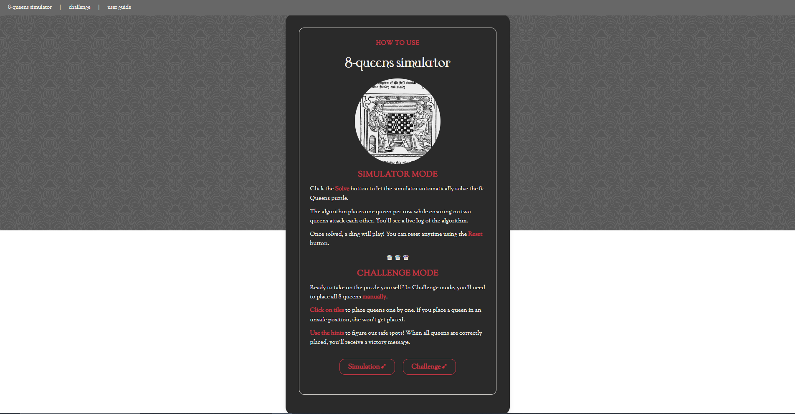
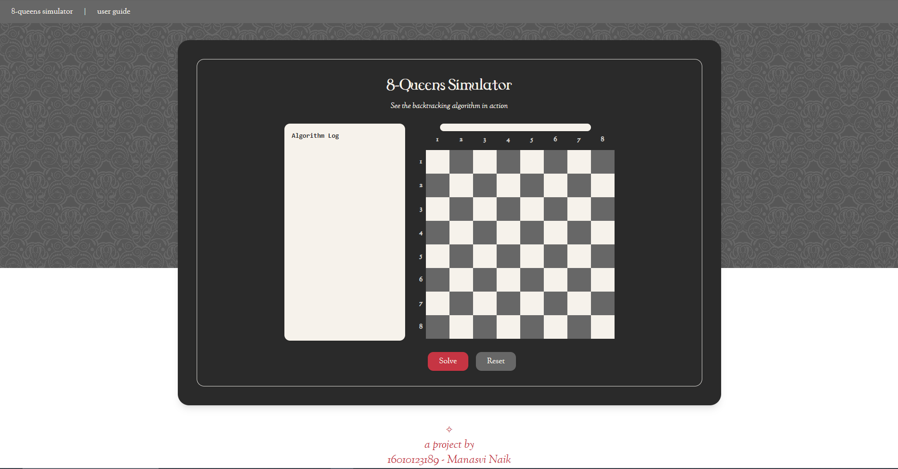
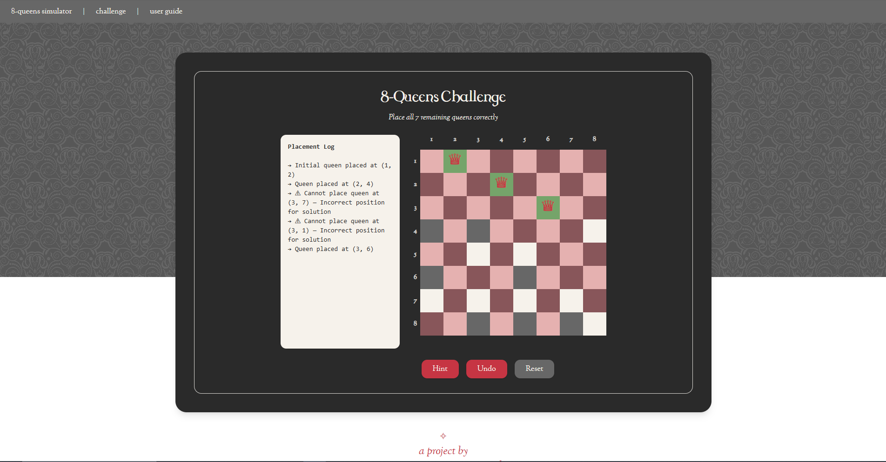

# ♛ 8-Queens Problem Simulator

A visual simulation of the 8-Queens problem using the **backtracking algorithm**, made for a college assignment.

Visit <a href="https://manasvinaik.github.io/eight-queens-simulator/" target="_blank">here</a>
---

## What is the 8-Queens Problem?

Place 8 queens on a standard 8×8 chessboard such that no two queens threaten each other.  
This means no two queens can share the same **row, column, or diagonal**.

This project **visually demonstrates** how a **backtracking algorithm** finds a valid configuration.

---

## Features

- A clean, responsive UI styled with Tailwind CSS
- Step-by-step queen placement with **algorithm logs** and a live progress bar
- Custom fonts and aesthetic theme
- **Challenge mode** for users to manually solve the puzzle with safety highlights (shows red for unsafe moves)

---

## Modes

### Simulator Mode  
Watch the algorithm solve the puzzle with live commentary, logs, and visual feedback.

### Challenge Mode  
Try solving the 8-Queens problem yourself!  
Place queens manually — unsafe tiles glow red and only correct configurations are accepted.

---

## Preview

<p align="center">
  
  <br><br>
  
  <br><br>
  
</p>

---

## Installation & Setup

1. **Clone or Download** the repository.

```bash
git clone https://github.com/your-username/8-queens-simulator.git
